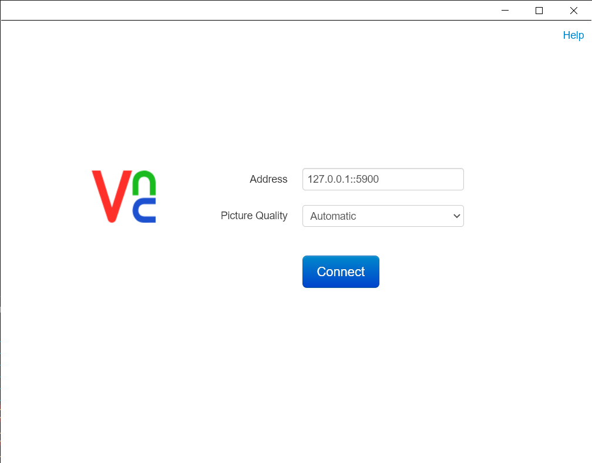
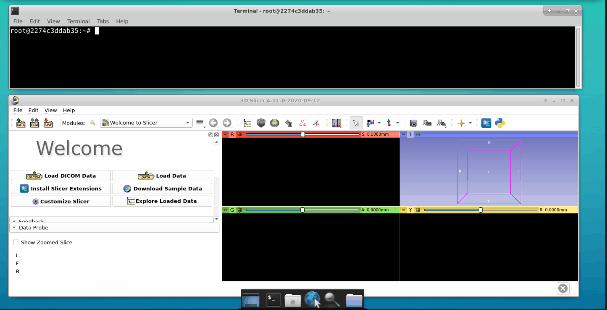

# qStudy
A web app to conduct studies for medical images made using magic of 3d slicer, VNC and web apps.

## Installation
To proceed with installation `docker` and `docker-compose` are required.

Build the docker image from the `docker-compose.yml` file as follows:
```
docker-compose build
```

## Usage

1. Create a `data` direcotry and move all the DICOM files (.nii.gz files) to that `data` folder.
    Also, add `db_nii.csv` file to `data` directory with UID and DICOM file path for each data file inside the `data` directory.

    A sample of the `db_nii.csv` file should look like
    ```
    uid,filepath
    1.2.3.4.5,/root/data/1.2.3.4.5.nii.gz
    ```

    We mount this `data` volume to the `data` directory inside the docker container.

2. Create and run a docker container based on the docker image we build.

    Run with logs.
    ```
    docker-compose up.
    ```

    Run in the detached mode.
    ```
    docker-compose up -d
    ```

3. Once docker container is up and running, 3d slicer can be accessed via VNC viewer at `127.0.0.1:5900`.

    

    **Note: The default password for VNC viewer is `vncpassword@123` which can be configured in `docker-compose.yml` before building a docker image.**

4. Open a new tab in the terminal and interact with the Flask API. We can load data into the 3d slicer tool as follows:

    

    *Note: In case of a failure or issues faced, perform `docker-compose down` and `docker-compose up`.*